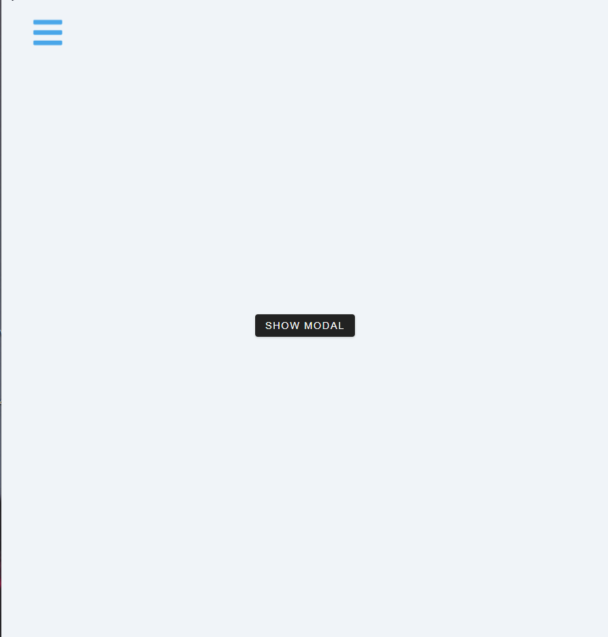

<h1 align="center">
  Sidebar and Modal
</h1>

## 💻 Project

- Learning ReactJS;
- Working with hooks such as 'useContext' and a custom hook to use global context.

&nbsp;&nbsp;

---

## 🔥 Check it out!

 

- [https://sidebar-and-modal.netlify.app/](https://sidebar-and-modal.netlify.app/)

  

&nbsp;&nbsp;

